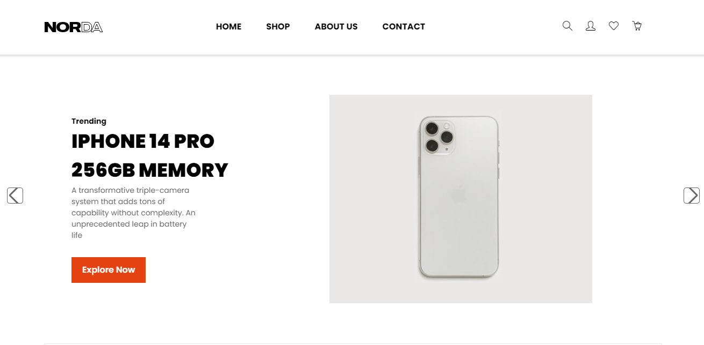

<h1 align="center">
  Norda E-Commerce Online Shop
</h1>

> ### Norda E-Commerce is built with the MERN stack & Redux Toolkit.

## Features

- Full featured shopping cart.
- Product reviews and ratings.
- Product search feature.
- User profile with orders.
- Admin product management.
- Checkout process (shipping, payment method, etc).

## Engines:

1. Node Version: ^16.17.0
2. Yarn Version: ^1.22.19

## Technologies in use

1. [React JS](https://reactjs.org/)
1. [Tailwind CSS](https://tailwindcss.com/)
1. [Material UI](https://mui.com/)
1. [Node Js](https://nodejs.org/)
1. [Mongoose JS](https://mongoosejs.com/)
1. [Json Web Tokens](https://jwt.io/)
1. [React Router Dom V6](https://v6.react-router-dom.com/)
1. [Create Next App](https://github.com/zeit/next.js/tree/canary/packages/create-next-app)
1. [yarn workspaces](https://classic.yarnpkg.com/)

## App Info

### Author

`Douglas Mayinja` [Mayinja6](https://github.com/Mayinja6)

### Version

`1.0.0`

### License

`This project is licensed under the MIT License`
